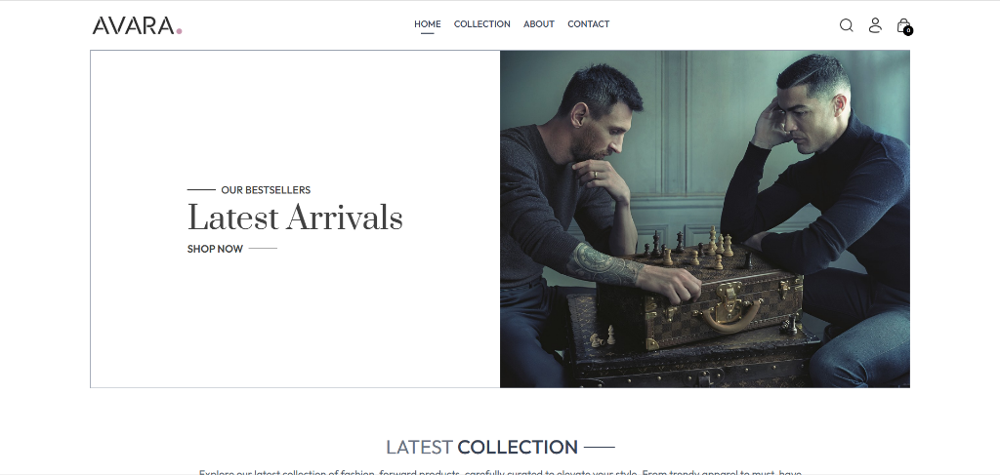

# 🛍️ Avara – MERN Virtual Try-On Store

A full-stack e-commerce web application built with the **MERN stack** (MongoDB, Express.js, React, Node.js), featuring an AI-powered **Virtual Try-On** system powered by the [Kwai-Kolors/Kolors-Virtual-Try-On](https://huggingface.co/spaces/Kwai-Kolors/Kolors-Virtual-Try-On) HuggingFace Space — completely **free**, no API key required.


* 🛒 **Customer Storefront:** [avara-shop.vercel.app](https://avara-shop.vercel.app/)
* 🔧 **Admin Panel:** [admin-avara-shop.vercel.app/list](https://admin-avara-shop.vercel.app/list)

<p align="center">
  
</p>

---

## 📋 Table of Contents

- [Features](#-features)
- [Tech Stack](#-tech-stack)
- [Project Structure](#-project-structure)
- [Architecture Overview](#-architecture-overview)
- [API Endpoints](#-api-endpoints)
- [Virtual Try-On Flow](#-virtual-try-on-flow)
- [Getting Started](#-getting-started)
- [Environment Variables](#-environment-variables)
- [Deployment](#-deployment)
- [Contributing](#-contributing)
- [Contributors](#-contributors)
- [License](#-license)

---

## ✨ Features

### 🛒 Customer Storefront (`/frontend`)
- **Home Page** – Hero banner, latest collections, bestsellers, brand policies, newsletter signup
- **Product Collection** – Filter by category (Men/Women/Kids) & subcategory (Topwear, Bottomwear, Winterwear, Dresses), sort by price/relevance
- **Product Detail Page** – Image gallery, size selector, add to cart, Virtual Try-On button
- **🤖 Virtual Try-On** – Upload your photo and see how a garment looks on you in seconds, powered by AI
- **Shopping Cart** – Real-time quantity updates, cart total, delivery fee calculation
- **Checkout** – Delivery address form with multiple payment options
- **Payment Methods:**
  - Cash on Delivery (COD)
  - Stripe (card payment)
- **Order History** – Track all past orders with real-time status
- **User Authentication** – Register / Login with JWT-based auth, persistent sessions
- **Search** – Full-text product search with live filtering
- **Responsive Design** – Mobile-first, fully responsive across all screen sizes

### 🔧 Admin Panel (`/admin`)
- **Secure Login** – Password-protected admin access
- **Add / Edit Product** – Upload up to 4 product images, set name, description, price, category, subcategory, sizes, bestseller flag
- **Product List** – View, edit, and delete all products
- **Order Management** – View all customer orders, update order status (Packing → Shipped → Out for delivery → Delivered)

---

## 🧰 Tech Stack

### Frontend & Admin
| Technology | Purpose |
|---|---|
| React 19 | UI framework |
| Vite | Build tool & dev server |
| React Router DOM | Client-side routing |
| Axios | HTTP client |
| React Toastify | Toast notifications |
| TailwindCSS | Utility-first styling |
| Context API | Global state management |

### Backend
| Technology | Purpose |
|---|---|
| Node.js + Express 5 | REST API server |
| MongoDB + Mongoose | Database & ODM |
| Cloudinary | Image hosting & CDN |
| JWT (jsonwebtoken) | Authentication tokens |
| Multer | Multipart file upload handling |
| bcrypt | Password hashing |
| Stripe | Online payment processing |
| @gradio/client | HuggingFace Spaces API client |
| Nodemon | Dev auto-restart |

### External Services
| Service | Purpose |
|---|---|
| MongoDB Atlas | Cloud database |
| Cloudinary | Product & try-on image storage |
| Stripe | Payment gateway |
| HuggingFace Spaces | AI Virtual Try-On inference (free) |

---

## 📁 Project Structure

```
mern-virtual-tryon-store/
├── frontend/                     # Customer-facing React app
│   ├── public/
│   │   └── avara_favicon.png
│   ├── src/
│   │   ├── assets/frontend_assets/
│   │   ├── components/
│   │   │   ├── Navbar.jsx         # Top navigation bar
│   │   │   ├── Footer.jsx         # Site footer
│   │   │   ├── Hero.jsx           # Home hero banner
│   │   │   ├── BestSeller.jsx     # Bestseller section
│   │   │   ├── LatestCollection.jsx
│   │   │   ├── OurPolicy.jsx      # Brand policy section
│   │   │   ├── NewsletterBox.jsx  # Newsletter signup
│   │   │   ├── SearchBar.jsx      # Product search overlay
│   │   │   ├── CartTotal.jsx      # Cart summary
│   │   │   ├── ProductItem.jsx    # Product card
│   │   │   ├── RelatedProducts.jsx
│   │   │   ├── Title.jsx          # Section title
│   │   │   └── VirtualTryOn.jsx   # ✨ AI Try-On modal
│   │   ├── context/
│   │   │   ├── Context.js         # ShopContext definition
│   │   │   └── ShopContext.jsx    # Global state provider
│   │   ├── pages/
│   │   │   ├── Home.jsx
│   │   │   ├── Collection.jsx     # Product listing + filters
│   │   │   ├── Product.jsx        # Product detail + Try-On
│   │   │   ├── Cart.jsx
│   │   │   ├── PlaceOrder.jsx     # Checkout page
│   │   │   ├── Orders.jsx         # Order history
│   │   │   ├── Login.jsx          # Register / Login
│   │   │   ├── About.jsx
│   │   │   ├── Contact.jsx
│   │   │   └── Verify.jsx         # Stripe payment verification
│   │   ├── App.jsx
│   │   └── main.jsx
│   ├── index.html
│   └── package.json
│
├── admin/                         # Admin panel React app
│   ├── public/
│   │   └── avara_favicon.png
│   ├── src/
│   │   ├── components/
│   │   │   ├── Navbar.jsx
│   │   │   ├── Sidebar.jsx        # Navigation sidebar
│   │   │   └── Login.jsx          # Admin login form
│   │   ├── pages/
│   │   │   ├── Add.jsx            # Add / Edit product
│   │   │   ├── List.jsx           # Product list management
│   │   │   └── Orders.jsx         # Order management
│   │   ├── config.js              # Backend URL + currency config
│   │   ├── App.jsx
│   │   └── main.jsx
│   ├── index.html
│   └── package.json
│
└── backend/                       # Express REST API
    ├── config/
    │   ├── mongodb.js             # MongoDB connection (with DNS fix)
    │   └── cloudinary.js          # Cloudinary initialization
    ├── controllers/
    │   ├── userController.js      # Register, Login
    │   ├── productController.js   # CRUD products
    │   ├── cartController.js      # Cart operations
    │   ├── orderController.js     # Orders + Stripe payment
    │   └── tryonController.js     # ✨ AI Virtual Try-On
    ├── middleware/
    │   ├── auth.js                # JWT user authentication
    │   ├── adminAuth.js           # Admin token validation
    │   └── multer.js              # File upload config
    ├── models/
    │   ├── userModel.js
    │   ├── productModel.js
    │   └── orderModel.js
    ├── routes/
    │   ├── userRoute.js
    │   ├── productRoute.js
    │   ├── cartRoute.js
    │   ├── orderRoute.js
    │   └── tryonRoute.js          # ✨ Try-On route
    ├── server.js                  # App entry point
    ├── vercel.json                # Vercel deployment config
    └── .env.sample                # Environment variables template
```

---

## 🏗️ Architecture Overview

```
┌─────────────────┐     HTTPS      ┌──────────────────────────┐
│  Frontend       │◄──────────────►│  Backend (Express API)   │
│  (React/Vite)   │                │  /api/user               │
│  Port: 5173     │                │  /api/product            │
└─────────────────┘                │  /api/cart               │
                                   │  /api/order              │
┌─────────────────┐                │  /api/tryon              │
│  Admin Panel    │◄──────────────►│                          │
│  (React/Vite)   │                └─────────┬────────────────┘
│  Port: 5174     │                          │
└─────────────────┘                ┌─────────▼────────────────┐
                                   │  MongoDB Atlas            │
                                   │  (Users, Products, Orders)│
                                   └──────────────────────────┘
                                   ┌──────────────────────────┐
                                   │  Cloudinary CDN           │
                                   │  (Product images,         │
                                   │   Try-on results)         │
                                   └──────────────────────────┘
                                   ┌──────────────────────────┐
                                   │  HuggingFace Spaces       │
                                   │  Kwai-Kolors/Virtual-     │
                                   │  Try-On (Free AI)         │
                                   └──────────────────────────┘
```

---

## 📡 API Endpoints

### User – `/api/user`
| Method | Endpoint | Auth | Description |
|--------|----------|------|-------------|
| POST | `/register` | ❌ | Create new account |
| POST | `/login` | ❌ | Login, returns JWT token |
| POST | `/admin` | ❌ | Admin login |

### Product – `/api/product`
| Method | Endpoint | Auth | Description |
|--------|----------|------|-------------|
| POST | `/add` | 🔑 Admin | Add new product (multipart) |
| POST | `/update` | 🔑 Admin | Update product |
| POST | `/remove` | 🔑 Admin | Delete product |
| GET | `/list` | ❌ | Get all products |
| POST | `/single` | ❌ | Get single product by ID |

### Cart – `/api/cart`
| Method | Endpoint | Auth | Description |
|--------|----------|------|-------------|
| POST | `/add` | 🔐 User | Add item to cart |
| POST | `/update` | 🔐 User | Update item quantity |
| POST | `/get` | 🔐 User | Get user's cart |

### Order – `/api/order`
| Method | Endpoint | Auth | Description |
|--------|----------|------|-------------|
| POST | `/place` | 🔐 User | Place COD order |
| POST | `/stripe` | 🔐 User | Place Stripe order |
| POST | `/verifyStripe` | 🔐 User | Verify Stripe payment |
| POST | `/userorders` | 🔐 User | Get user's order history |
| POST | `/list` | 🔑 Admin | Get all orders |
| POST | `/status` | 🔑 Admin | Update order status |

### Virtual Try-On – `/api/tryon`
| Method | Endpoint | Auth | Description |
|--------|----------|------|-------------|
| POST | `/` | 🔐 User | Generate AI try-on result (multipart) |

**Request body (multipart/form-data):**
```
personImage    – image file  (user's photo, max 10 MB)
garmentImageUrl – string     (product image URL from Cloudinary)
category       – string      (Men | Women | Kids)
subCategory    – string      (Topwear | Bottomwear | Winterwear | Dresses)
```

**Response:**
```json
{
  "success": true,
  "resultImageUrl": "https://res.cloudinary.com/...",
  "clothType": "upper_body",
  "message": "Virtual try-on generated successfully!"
}
```

---

## 🤖 Virtual Try-On Flow

```
User clicks "✨ Virtual Try-On"
        │
        ├─ Not logged in? → Redirect to /login
        │
        ▼
  Modal opens (shows user upload + garment preview)
        │
        ▼
  User uploads personal photo (drag & drop or click)
        │
        ▼
  User clicks "⚡ Generate"
        │
        ▼
  [Frontend] POST /api/tryon (FormData: personImage + garmentImageUrl)
        │
        ▼
  [Backend] 1. Validate inputs
        │
        ▼
  [Backend] 2. Upload user photo → Cloudinary (tryon_temp/)
             (temp file auto-deleted from disk after upload)
        │
        ▼
  [Backend] 3. Detect cloth type from subCategory:
             Topwear/Winterwear → upper_body
             Bottomwear         → lower_body
             Dresses            → dresses
        │
        ▼
  [Backend] 4. Connect to HuggingFace Space
             Kwai-Kolors/Kolors-Virtual-Try-On
             (free, no API key required)
        │
        ▼
  [Backend] 5. Call predict(2, [personImg, garmentImg, seed, randomSeed])
             ⏱ Timeout: 5 minutes
        │
        ▼
  [Backend] 6. Fetch result image via authenticated client.fetch()
             → Convert to Base64
             → Upload to Cloudinary (tryon_results/)
        │
        ▼
  [Backend] 7. Return Cloudinary URL to frontend
        │
        ▼
  [Frontend] Display result image with:
             - 🔍 Fullscreen lightbox (click to zoom)
             - ⬇️ Download button (force-downloads as .webp)
             - 🔄 Try Again button
```

---

## 🚀 Getting Started

### Prerequisites
- Node.js ≥ 18
- npm ≥ 9
- MongoDB Atlas account (free tier works)
- Cloudinary account (free tier works)
- Stripe account (for online payments)

### 1. Clone the repository

```bash
git clone https://github.com/your-username/mern-virtual-tryon-store.git
cd mern-virtual-tryon-store
```

### 2. Setup Backend

```bash
cd backend
npm install
cp .env.sample .env
# Fill in your environment variables in .env
npm run dev
# Server starts at http://localhost:4000
```

### 3. Setup Frontend

```bash
cd frontend
npm install
cp .env.sample .env
# Fill/verify VITE_BACKEND_URL in .env
npm run dev
# App starts at http://localhost:5173
```

### 4. Setup Admin Panel

```bash
cd admin
npm install
cp .env.sample .env
# Fill/verify VITE_BACKEND_URL in .env
npm run dev
# Admin panel starts at http://localhost:5174
```

---

## 🔐 Environment Variables

### 🨅 Backend (`/backend`)

Create a `.env` file in the `/backend` directory based on `.env.sample`:

```env
# MongoDB Atlas connection string
MONGODB_URL=mongodb+srv://<username>:<password>@cluster.mongodb.net/avara

# Cloudinary credentials (cloudinary.com)
CLOUDINARY_CLOUD_NAME=your_cloud_name
CLOUDINARY_API_KEY=your_api_key
CLOUDINARY_API_SECRET=your_api_secret

# Server port
PORT=4000

# JWT secret key (any random string)
JWT_SECRET=your_super_secret_key

# Admin credentials for the admin panel
ADMIN_EMAIL=admin@avara.com
ADMIN_PASSWORD=your_admin_password

# Stripe secret key (stripe.com)
STRIPE_SECRET_KEY=sk_test_...

# HuggingFace token (OPTIONAL – free at huggingface.co/settings/tokens)
# Works without it, but having one avoids rate limits
HF_TOKEN=hf_...
```

> **Note:** The Virtual Try-On feature works **completely free** without any `HF_TOKEN`. Adding a token helps avoid rate limits during heavy usage.

### 💻 Customer Storefront (`/frontend`)

Create a `.env` file in the `/frontend` directory based on `.env.sample`:

```env
# URL of the backend server that the frontend will communicate with.
VITE_BACKEND_URL=http://localhost:4000
```

### 🔧 Admin Panel (`/admin`)

Create a `.env` file in the `/admin` directory based on `.env.sample`:

```env
# URL of the backend server that the admin panel will communicate with.
VITE_BACKEND_URL=http://localhost:4000
```

---

## 🌐 Deployment

This project is configured for deployment on **Vercel** (all 3 apps can be deployed separately).

### Backend (Vercel)
The `backend/vercel.json` is already configured. Just connect your GitHub repo to Vercel and set the environment variables in the Vercel dashboard.

### Frontend & Admin (Vercel)
1. Create two separate Vercel projects, one for `frontend/` and one for `admin/`
2. Set **Root Directory** to `frontend` or `admin` respectively
3. Add environment variable:
   ```
   VITE_BACKEND_URL=https://your-backend.vercel.app
   ```

> **Important:** Vercel runs on Linux (case-sensitive filesystem). All import paths must match the exact filename casing.

---

## 📊 Database Models

### User
```js
{
  name: String,
  email: String,       // unique
  password: String,    // bcrypt hashed
  cartData: Object     // { productId: { size: quantity } }
}
```

### Product
```js
{
  name: String,
  description: String,
  price: Number,
  image: Array,        // Cloudinary URLs (up to 4)
  category: String,    // Men | Women | Kids
  subCategory: String, // Topwear | Bottomwear | Winterwear | Dresses
  sizes: Array,        // ["S", "M", "L", "XL", "XXL"]
  bestseller: Boolean,
  date: Number         // timestamp
}
```

### Order
```js
{
  userId: String,
  items: Array,        // [{ _id, name, price, quantity, size }]
  amount: Number,      // total including delivery
  address: Object,     // shipping address
  status: String,      // "Order Placed" | "Packing" | "Shipped" | "Out for delivery" | "Delivered"
  paymentMethod: String, // "COD" | "Stripe"
  payment: Boolean,    // true = paid
  date: Number         // timestamp
}
```

---

## 🙏 Acknowledgements

- [Kwai-Kolors/Kolors-Virtual-Try-On](https://huggingface.co/spaces/Kwai-Kolors/Kolors-Virtual-Try-On) – Free AI virtual try-on model
- [Gradio](https://www.gradio.app/) – HuggingFace Space API client
- [Cloudinary](https://cloudinary.com/) – Image hosting & transformation
- [Stripe](https://stripe.com/) – Payment processing

---

## 🤝 Contributing

Contributions are welcome! If you find a bug or want to suggest an improvement, please open an issue or submit a pull request.

1. Fork the repository
2. Create your feature branch (`git checkout -b feature/AmazingFeature`)
3. Commit your changes (`git commit -m 'Add some AmazingFeature'`)
4. Push to the branch (`git push origin feature/AmazingFeature`)
5. Open a Pull Request

---

## 👥 Contributors

This project was developed by a dedicated team of students from **Ho Chi Minh City International University (HCMIU)**:

| Name | Student ID | Role | GitHub |
| :--- | :--- | :--- | :--- |
| **Nguyễn Minh Khôi** | `ITCSIU22210` | Full-Stack Developer | [@enemkayy](https://github.com/enemkayy) |
| **Vương Quán Siêu** | `ITCSIU22270` |  Full-Stack Developer | [@VSieu](https://github.com/VSieu) |


---

## 📄 License

This project is licensed under the MIT License - see the [LICENSE](LICENSE) file for details.

---

<div align="center">
  <p>Built with ❤️ using the MERN Stack</p>
  <p><strong>MongoDB · Express · React · Node.js</strong></p>
</div>
